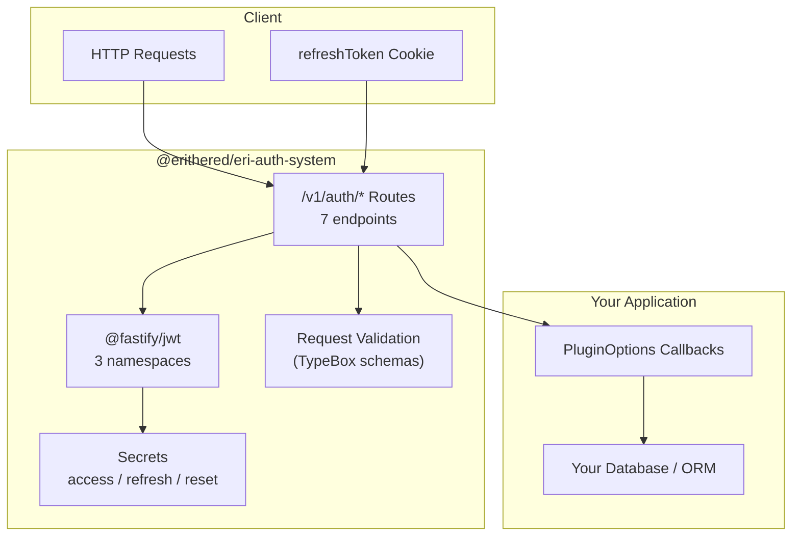

<div align="center">

<!--

-->

# Eri's auth system

_`@erithered/eri-auth-system` — Fastify auth plugin with JWT access/refresh/reset tokens, email-based password reset, and logout-all-devices support._

**Coded by a human, assisted by AI** to set up a comprehensive code quality framework (strict TypeScript, ESLint + Prettier, knip, husky + lint-staged, conventional commits, vitest with 80%+ coverage, semantic-release, publint, attw, cspell) and extracted from its original project into a standalone publishable package.

---

[](https://www.npmjs.com/package/@erithered/eri-auth-system)
[](https://github.com/SirEriTheRed/eri-auth-system/actions)
[](https://github.com/SirEriTheRed/eri-auth-system)
[](https://nodejs.org)
[](./LICENSE)
[](https://www.npmjs.com/package/@erithered/eri-auth-system)

[📦 Install](#-installation) • [📖 Documentation](#-documentation) • [🔗 Resources](#-resources) • [💬 Community](#-community) • [💬 Contact](#-contact)

</div>

---

## 📚 Table of Contents

- [Eri's auth system](#readme)
  - [📚 Table of Contents](#-table-of-contents)
  - [🧰 Tech Stack](#-tech-stack)
  - [🗺️ Architecture](#️-architecture)
  - [✨ Features](#-features)
  - [🚀 Getting Started](#-getting-started)
    - [📦 Installation](#-installation)
    - [⚡ Quickstart](#-quickstart)
  - [📂 File Structure & Naming](#-file-structure--naming)
  - [📖 Documentation](#-documentation)
  - [🔗 Resources](#-resources)
  - [💬 Community](#-community)
  - [💬 Contact](#-contact)
  - [Contributors](#contributors)
  - [🙏 Thanks & Acknowledgments](#-thanks--acknowledgments)
  - [📄 License](#-license)

---

<!--
## 🤔 Why Eri's auth system?

[Description]

[Arguments]

[Best features]

[Features comparison table]
[↑ Back to top](#-table-of-contents)

---
-->

<!--
  Tech Stack — list each technology used.
-->

## 🧰 Tech Stack

| Layer            | Technology        | Version |
| ---------------- | ----------------- | ------- |
| Runtime          | Node.js           | >=18    |
| Framework        | Fastify           | >=4     |
| JWT              | @fastify/jwt      | >=8     |
| Cookies          | @fastify/cookie   | >=9     |
| Validation       | @sinclair/typebox | ^0.32   |
| Password Hashing | argon2            | ^0.31   |
| Language         | TypeScript        | ^5.9    |
| Testing          | Vitest            | ^4.1    |

[↑ Back to top](#-table-of-contents)

---

<!--
  Architecture — Mermaid diagram showing how the plugin integrates
  into a consumer's Fastify application, followed by the route table
  and JWT namespace details.
-->

## 🗺️ Architecture



The plugin registers 7 routes under `/v1/auth/*`. Each route uses one of three isolated @fastify/jwt namespaces (access / refresh / reset) for token handling. Business logic is delegated to consumer-provided callbacks, making the plugin agnostic to your database or ORM choice. Request validation uses TypeBox schemas. Error responses are customisable via the `analyseError` callback.

### Routes

All routes are registered under the `/v1/auth` prefix.

| Method | Path                    | Auth   | Description                                     |
| ------ | ----------------------- | ------ | ----------------------------------------------- |
| POST   | `/v1/auth/signup`       | —      | Create a new user account                       |
| POST   | `/v1/auth/login`        | —      | Authenticate with ID + password                 |
| GET    | `/v1/auth/refresh`      | Cookie | Rotate the access token using the refresh token |
| PATCH  | `/v1/auth/logout`       | Cookie | Revoke the current refresh token                |
| POST   | `/v1/auth/askPwdReset`  | —      | Request a password-reset email                  |
| PATCH  | `/v1/auth/pwdReset`     | Token  | Complete a password reset                       |
| GET    | `/v1/auth/is-logged-in` | Bearer | Validate the current access token               |

- **Auth: Cookie** — requires a signed `refreshToken` cookie
- **Auth: Bearer** — requires an `Authorization: Bearer <token>` header
- **Auth: Token** — token is sent in the request body

### JWT Namespaces

Three isolated [@fastify/jwt](https://github.com/fastify/fastify-jwt) namespaces, each with its own secret and purpose:

| Namespace   | Decorator             | Expiry | Transport                                |
| ----------- | --------------------- | ------ | ---------------------------------------- |
| **access**  | `request.accessUser`  | 15 min | `Authorization: Bearer` header           |
| **refresh** | `request.refreshUser` | 7 days | Signed HTTP-only cookie (`refreshToken`) |
| **reset**   | —                     | 15 min | URL query parameter (sent via email)     |

The refresh namespace includes a `trusted` function that checks revocation status via `getTokenRevokedAt` — even a valid, unexpired refresh token is rejected if it has been revoked.

### Response format

Successful responses return JSON or plain text. All errors follow this shape (customisable via the `analyseError` callback):

```json
{ "statusCode": 401, "error": "Invalid credentials", "message": "This password is invalid" }
```

[↑ Back to top](#-table-of-contents)

---

## ✨ Features

- **Three JWT namespaces** — access (15 min), refresh (7 days, signed cookie), reset (15 min, email link), each with an isolated secret
- **Email-based password reset** — signed reset token delivered via your `sendResetEmail` callback
- **Refresh token revocation** — expired or revoked tokens are rejected; custom revocation checking via `getTokenRevokedAt`
- **Logout-all-devices** — revoke every active refresh token on password reset
- **Custom error handling** — map database or system errors to user-facing messages via `analyseError`
- **Full TypeScript types** — Fastify decorator augmentations included, zero extra configuration
- **80 %+ test coverage** — integration tests covering all 7 routes and error branches

[↑ Back to top](#-table-of-contents)

---

## 🚀 Getting Started

### 📦 Installation

```bash
npm install @erithered/eri-auth-system
```

**Peer dependencies — your application must provide these:**

```bash
npm install fastify @fastify/jwt @fastify/cookie @sinclair/typebox
```

### ⚡ Quickstart

```typescript
import Fastify from 'fastify';
import { authPlugin, type PluginOptions } from '@erithered/eri-auth-system';

const app = Fastify();

await app.register(authPlugin, {
  accessSecret: process.env.ACCESS_SECRET!,
  refreshSecret: process.env.REFRESH_SECRET!,
  resetSecret: process.env.RESET_SECRET!,
  siteUrl: 'https://myapp.com',
  findUser: async (id) => db.users.findById(id),
  createUser: async (id, email, birthday) => db.users.create(id, email, birthday),
  revokeToken: async (token) => db.tokens.revoke(token),
  sendResetEmail: async (to, link) => mailer.send(to, link),
  createRefreshToken: async (userId, token, expiresAt) =>
    db.refreshTokens.insert({ userId, token, expiresAt }),
  updateUserPassword: async (userId, hash) => db.users.updatePassword(userId, hash),
  logoutAllDevices: async (userId) => db.tokens.revokeAll(userId),
  analyseError: async (err) => (err.code === 'P2002' ? 'This user ID is already taken' : null),
  getTokenRevokedAt: async (token) => db.tokens.revokedAt(token),
});

await app.listen({ port: 3000 });
```

[↑ Back to top](#-table-of-contents)

---

## 📂 File Structure & Naming

```
src
├── auth-plugin.test.ts
├── index.ts
├── plugins
│   └── authenticate.ts
├── routes
│   └── v1
│       └── auth
│           ├── ask-pwd-reset.ts
│           ├── is-logged-in.ts
│           ├── login.ts
│           ├── logout.ts
│           ├── pwd-reset.ts
│           ├── refresh.ts
│           └── signup.ts
└── types
    ├── fastify.d.ts
    └── plugin-options.ts
```

**Naming conventions:**

- **Filenames** — kebab-case throughout (e.g. `ask-pwd-reset.ts`, `plugin-options.ts`)
- **Routes** — co-located by version under `routes/v1/auth/`
- **Plugins** — Fastify plugin decorators in `plugins/`
- **Types** — TypeScript type definitions in `types/`
- **Test file** — single integration test at `src/auth-plugin.test.ts`

[↑ Back to top](#-table-of-contents)

---

## 📖 Documentation

Full API documentation generated by TypeDoc is available in the [`docs/`](./docs) directory.

### PluginOptions

All fields are **required**. The plugin validates their presence at registration time.

**Secrets:**

| Field           | Type     | Description                                                                   |
| --------------- | -------- | ----------------------------------------------------------------------------- |
| `accessSecret`  | `string` | Secret for signing/verifying short-lived **access** JWT (15 min)              |
| `refreshSecret` | `string` | Secret for signing/verifying long-lived **refresh** JWT (7 days)              |
| `resetSecret`   | `string` | Secret for signing/verifying **password-reset** JWT (15 min)                  |
| `siteUrl`       | `string` | Base URL used to construct the password-reset link (e.g. `https://myapp.com`) |

**Callbacks:**

| Callback             | Signature                                                            | Called when…                                                          |
| -------------------- | -------------------------------------------------------------------- | --------------------------------------------------------------------- |
| `findUser`           | `(userId: string) => Promise<{ id, hashedPassword, email } \| null>` | Login, password reset — looks up a user by ID                         |
| `createUser`         | `(userId: string, email: string, birthday: string) => Promise<void>` | Signup — creates a new user record                                    |
| `revokeToken`        | `(token: string \| undefined) => Promise<void>`                      | Logout — marks a refresh token as revoked                             |
| `sendResetEmail`     | `(to: string, resetLink: string) => Promise<void>`                   | Password reset request — delivers the reset link                      |
| `createRefreshToken` | `(userId: string, token: string, expiresAt: Date) => Promise<void>`  | Login — persists a refresh token for later revocation                 |
| `updateUserPassword` | `(userId: string, hashedPassword: string) => Promise<void>`          | Password reset — updates the stored password hash                     |
| `logoutAllDevices`   | `(userId: string) => Promise<void>`                                  | Password reset — revokes all active refresh tokens                    |
| `analyseError`       | `(error: unknown) => Promise<string \| null>`                        | Error handling — maps a caught error to a user-facing message         |
| `getTokenRevokedAt`  | `(token: string) => Promise<Date \| null>`                           | Every request with a refresh cookie — checks if the token was revoked |

### TypeScript

This package is fully typed. Augmentations for `FastifyInstance`, `FastifyRequest`, and `FastifyReply` are provided in `src/types/fastify.d.ts` and are automatically available when you import the plugin.

```typescript
import { authPlugin, type PluginOptions } from '@erithered/eri-auth-system';
```

If you need to reference the auth decorators on your Fastify instance, add a `fastify.d.ts` file in your project:

```typescript
import '@erithered/eri-auth-system';
```

[↑ Back to top](#-table-of-contents)

---

## 🔗 Resources

- [Fastify Documentation](https://fastify.dev/docs/latest/)
- [@fastify/jwt — GitHub](https://github.com/fastify/fastify-jwt)
- [@fastify/cookie — GitHub](https://github.com/fastify/fastify-cookie)
- [@sinclair/typebox — GitHub](https://github.com/sinclairzx81/typebox)
- [TypeScript Documentation](https://www.typescriptlang.org/docs/)

[↑ Back to top](#-table-of-contents)

---

## 💬 Community

- [GitHub Discussions](https://github.com/SirEriTheRed/eri-auth-system/discussions)

[↑ Back to top](#-table-of-contents)

---

## 💬 Contact

- Discord: sirerithered
- [GitHub](https://github.com/SirEriTheRed)

[↑ Back to top](#-table-of-contents)

---

<!--
## ❓ FAQ

<details>
<summary><strong>[Question]</strong></summary>

[Answer]

</details>
[... Repeat for each question]

[](https://github.com/SirEriTheRed/eri-auth-system/discussions/new/choose)

[↑ Back to top](#-table-of-contents)

---
-->

<!--
## 🔧 Troubleshooting

<details>
<summary><strong>[Issue]</strong></summary>

[Solution]

</details>
[... Repeat for each issue]

[](https://github.com/SirEriTheRed/eri-auth-system/issues/new/choose)

[↑ Back to top](#-table-of-contents)

---
-->

<!--
## 🤝 Contributing

Contributions are very welcome! Here's how to get started:

[Basic steps to start]

[where to find the contributor docs]

[↑ Back to top](#-table-of-contents)

---
-->

### Contributors


[↑ Back to top](#-table-of-contents)

---

## 🙏 Thanks & Acknowledgments

- [Fastify](https://fastify.dev/) team for the plugin ecosystem
- [@fastify/jwt](https://github.com/fastify/fastify-jwt) for JWT namespace support
- [@sinclair/typebox](https://github.com/sinclairzx81/typebox) for runtime type validation
- [Vitest](https://vitest.dev/) team for the testing framework
- Everyone who contributed, opened an issue, PR, or star ⭐

[↑ Back to top](#-table-of-contents)

---

## 📄 License

Distributed under the [ISC License](./LICENSE).

---

###### This README was generated using a [coding agent](https://opencode.ai) and the [`README-template.md`](./README-template.md).
